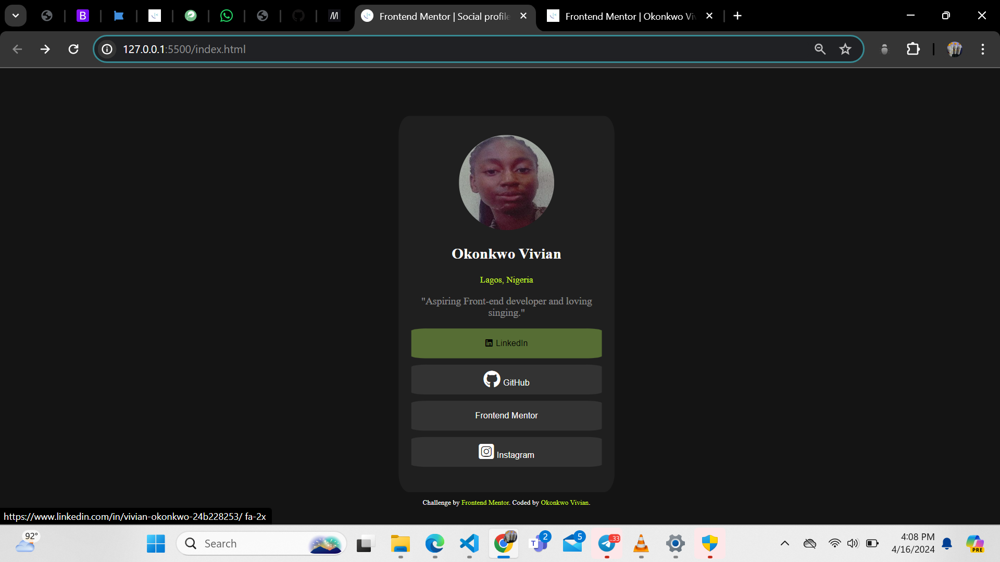

# Frontend Mentor - Social links profile solution

This is a solution to the [Social profile challenge on Frontend Mentor](https://www.frontendmentor.io/challenges/social-links-profile-UG32l9m6dQ). Frontend Mentor challenges help you improve your coding skills by building realistic projects. 

## Table of contents

- [Overview](#overview)
  - [The challenge](#the-challenge)
  - [Screenshot](#screenshot)
  - [Links](#links)
- [My process](#my-process)
  - [Built with](#built-with)
  - [What I learned](#what-i-learned)
  - [Continued development](#continued-development)
  - [Useful resources](#useful-resources)
- [Author](#author)


## Overview

### The challenge

Users should be able to:

- See hover and focus states for all interactive elements on the page

### Screenshot



### Links

- Solution URL: https://github.com/vivi-uch/social-profile
- Live Site URL: https://vivi-uch.github.io/social-profile/

## My process

### Built with

- Semantic HTML5 markup
- CSS custom properties


### What I learned

```html
<!-- font awesome, useful for adding icons and many more to your erbsite -->

<!-- a script tag must be embedded in the the head section to allow the icons or whatever show -->

<script src="https://kit.fontawesome.com/dcb37cc1ad.js" crossorigin="anonymous"></script>

```
```css
/* learnt about hover and focus */
a:hover{
    color: #000;
    font-size: bold;
}
button:focus{
    background-color: blue;
}
button:hover{
    background-color: rgb(86, 109, 52);
}
```

### Continued development

In later projects i want to have a better understanding on positions in CSS


### Useful resources

- [Frontend Mentor](https://www.frontendmentor.io/home) - This owner of this challenges.
- [Udemy Angela Yu Web dev course](https://www.udemy.com/course/the-complete-web-development-bootcamp/) - This is an amazing course that gave me insights in CSS in general.


## Author

- Linkeldn - [vivian okonkwo](https://www.linkedin.com/in/vivian-okonkwo-24b228253/)
- Frontend Mentor - [@okonks](https://www.frontendmentor.io/profile/okonks)

